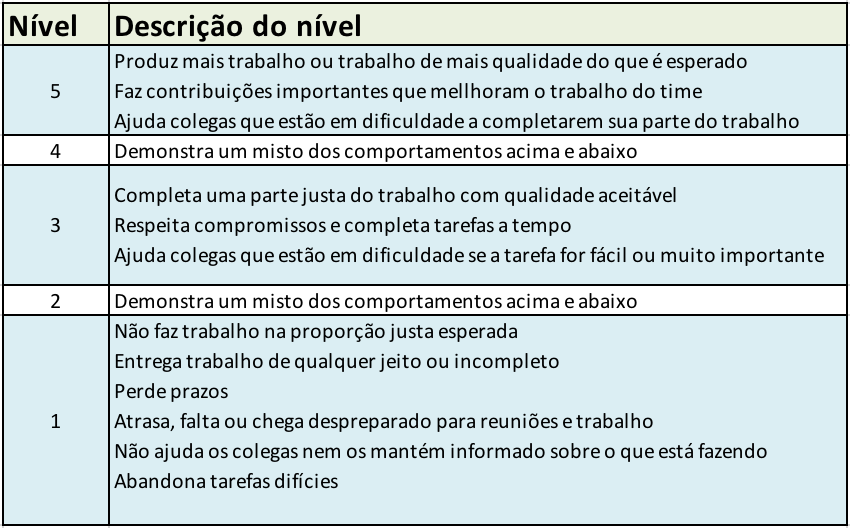
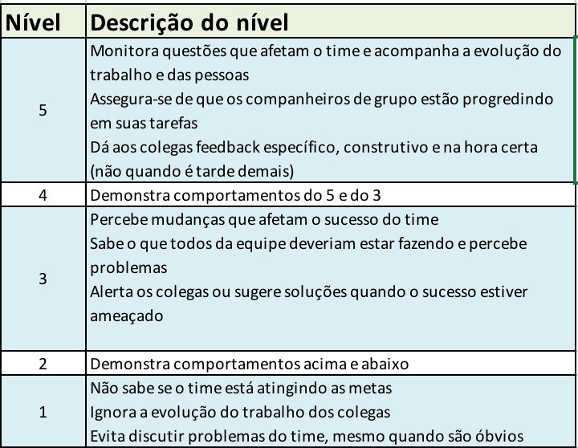
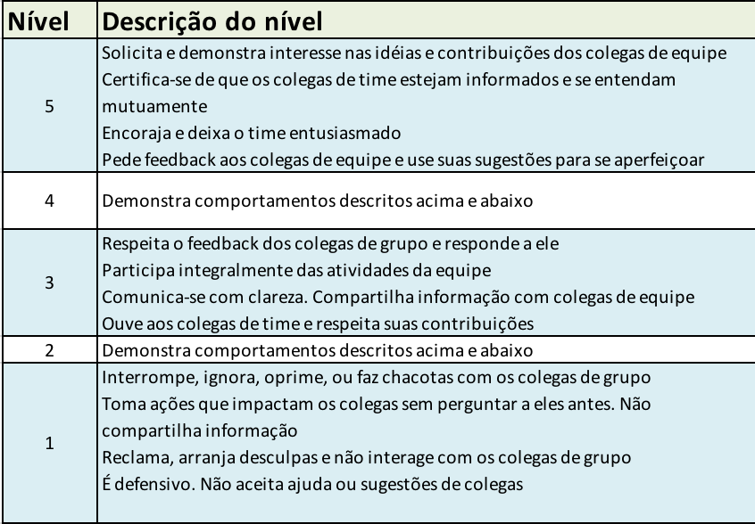

# Projeto 3

## Ciência dos Dados 2018

Este documento apresenta as premissas do projeto final de Ciência dos Dados.

### Objetivos

O principal objetivo do Projeto 3 é conduzir uma análise de dados com grau elevado de autonomia e liberdade de escolha de tema e de técnica.

Para que este fim possa ser alcançado, os estudantes deverão se aprofundar na técnica escolhida enquanto realizam o projeto.

É importante que o trabalho produza uma conclusão analítica e vá além da análise exploratória. Esta conclusão analítica deve ter a forma de classificação (supervisionada ou não supervisionada) ou regressão.

### Grupos

O projeto pode ser realizado em grupos de no máximo 3 alunos.

### Datas

Data | Entregável 
---|------------------------------------------------|
30/10 | Definição de grupo e até 3 propostas de tema (técnica e dataset)  por grupo 
1/11 | Até fim do dia ter escolhido dataset e tema
5/11 | Devolutiva dos professores
12/11 | Check intermediário - dataset lido, exploratória e exemplo de aplicação da técnica
21/11 | Análises concluídas - algoritmo gera alguma resposta
21/11 | FIM: Relatório com  explicação detalhada da aná;ise, conclusões e referências para fundamentação teórica

### Sugestões de temas a utilizar

#### 1. Regressão (linear ou logística)

Prever o valor de uma coluna de um dataset em função das outras. Pode ser uma regressão linear (se  a variável de saída for quantitativa) ou regressão logística (se a variável de saída for qualitativa)

Exemplos de datasets:

[Predição de preços de casas em King County, Seattle](https://www.kaggle.com/harlfoxem/housesalesprediction)

[Predição de por quanto uma casa vai ser vendida](https://www.kaggle.com/c/house-prices-advanced-regression-techniques)

[Predição de se funcionário vai deixar empresa ou não](https://www.kaggle.com/ludobenistant/hr-analytics/data)

[Predição de qual *rating* alguém vai dar para um filme no Netflix](https://www.kaggle.com/netflix-inc/netflix-prize-data/data)

#### 2. Classificadores - extensão do Naive Bayes

Baseado em todos os dados existentes, classificar em categorias

Exemplos de datasets:

[Porto Seguro - cliente vai acionar o seguro?](https://www.kaggle.com/c/porto-seguro-safe-driver-prediction/data)

[Deteção de fraude no cartão de crédito](https://www.kaggle.com/dalpozz/creditcardfraud)

[Deteção de fraude financeira](https://www.kaggle.com/ntnu-testimon/paysim1)

[Predição de se funcionário vai deixar empresa ou não](https://www.kaggle.com/ludobenistant/hr-analytics/data)

[Predição de sucesso de um filme](https://www.kaggle.com/tmdb/tmdb-movie-metadata)

#### 3. Clusterização

Agrupe os dados de um conjunto baseado em similaridade. Neste problema em geral pode-se escolher o número de *clusters* e o algoritmo precisa fazer o agrupamento.

Datasets interessantes para esta técnica

[Pokémon](https://www.kaggle.com/abcsds/pokemon)

[Fifa 18](https://www.kaggle.com/thec03u5/fifa-18-demo-player-dataset)

#### Datasets interessantes

Ainda não há pergunta definida, mas são datasets interessantes

[Futebol Europeu](https://www.kaggle.com/hugomathien/soccer/data)

[Reviews de smartphones na Amazon](https://www.kaggle.com/PromptCloudHQ/amazon-reviews-unlocked-mobile-phones)

[Filtro Anti Spam](https://www.kaggle.com/c/naive-bayes-spam-filter/data)

[Dataset da Enron. Mensagens classificadas em relação a assunto e sentimento](http://bailando.sims.berkeley.edu/enron_email.html)

[Predição se um produto entrou em falta - *backorder* - ou não](https://www.kaggle.com/tiredgeek/predict-bo-trial)

[Lista de todos os datasets do Kaggle](https://www.kaggle.com/datasets)

[Alguns datasets disponíveis publicamente](http://goo.gl/Wva3vA)

### Rubricas

Veja a tabela com a rubrica geral do projeto. Postada no Blackboard e também no Github.

### Dimensões de trabalho em equipe

$1/3$ do conceito do Projeto 3 vem de uma avaliação de trabalho em equipe.

Para ter a nota máxima, é preciso ter contribuições relevantes no Github do grupo **e** ter preenchido um formulário de avaliação dos colegas.

**Atenção: **  
A nota de trabalho em equipe nunca aumenta a nota geral do projeto. 

Em outras palavras, não adianta ter A em trabalho em equipe e D em projeto. A nota final ainda será D.

### Referências

Além dos materiais da disciplina e dos livros-texto, sugerimos as seguintes obras para uma visão geral de Machine Learning / Classificação em Python.

[Hands-on Machine Learning](
https://github.com/ageron/handson-ml)

[Python Data Science Handbook - Capítulo 5]
(https://jakevdp.github.io/PythonDataScienceHandbook/)

[Python Machine Learning](https://github.com/rasbt/python-machine-learning-book)

**Dica:** Encontre um *dataset* primeiro, depois formule uma pergunta, e daí busque uma técnica condizente.

