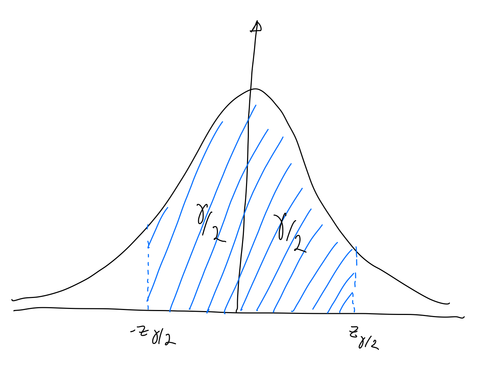

# Intervalo de confiança

## Intervalo de confiança para Normal

Vamos definir um nível de confiança $\gamma$. Sejam $-z_{\gamma/2}$ e $z_{\gamma/2}$ os valores que delimitam uma probabilidade $\gamma$ de forma simétrica na curva $\sim N(0,1)$

Temos que:

$P(-z_{\gamma/2} < Z < z_{\gamma/2}) = \gamma$

e

$-z_{\gamma/2} < Z < z_{\gamma/2}$

Podemos nos lembrar da parametrização para curva de médias amostrais:

$Z = \frac{\overline{X} - \mu}{\frac{\sigma}{\sqrt{n}}}$

Portanto:

$-z_{\gamma/2} < \frac{\overline{X} - \mu}{\frac{\sigma}{\sqrt{n}}}  < z_{\gamma/2}$

Se isolarmos o $\mu$ chegaremos a:

$\overline{X} - z_{\gamma/2} \frac{\sigma}{\sqrt{n}} < \mu < \overline{X} + z_{\gamma/2} \frac{\sigma}{\sqrt{n}}$ 

A inequação acima nos define uma faixa com $\gamma$ de probabilidade de conter $\mu$ . Podemos escrevê-la na forma de um intervalo:

$IC(\mu, \gamma) = [ \overline{X} - z_{\gamma/2} \frac{\sigma}{\sqrt{n}}; \overline{X} + z_{\gamma/2} \frac{\sigma}{\sqrt{n}} ]$

## Erro de estimativa 

Costuma-se usar como estimativa de erro o valor de metade do intervalo de confiança

$E = z_{\gamma/2}\frac{\sigma}{\sqrt{n}}$

Isolando o $n$ temos:

$n = ( z_{\gamma/2} \frac{\sigma}{E} )^2$

## Intervalo de confiança para t

Podemos fazer uma derivação análoga para a distribuição $t$:

$IC(\mu, \gamma) = [ \overline{X} - t_{\gamma/2} \frac{s}{\sqrt{n}}; \overline{X} + t_{\gamma/2} \frac{s}{\sqrt{n}} ]$

## Exercícios 

**Exercício 1** 

Fonte: Montgomery 8-2

[Ishikawa et al. (Journal of Bioscience and Bioengineering, 2012)](https://www.sciencedirect.com/science/article/pii/S1389172312000321)  estudou a aderência de vários filmes biológicos a superfícies sólidas, para possível uso em tecnologias para aplicação no meio-ambiente.  Suponha que para a cepa de bactérias *Acinetobacter*, cinco medidas geraram as seguintes leituras, em $dyne\textrm{-}cm^2$

    2.69 5.76 2.67 1.62 4.12

Assuma, ainda que o desvio padrão é conhecido e igual a $0.66$ $dyne \textrm{-}  cm^2$

Pede-se:

1. Encontre um intervalo de confiança de $\gamma=95\%$ para a aderência média
1. Se os cientistas quisessem que o intervalo de confiança não fosse maior que $0.55$ $dyne\textrm{-}cm^2$, quantas observações deveriam coletar?

**Exercício 2** 

Fonte: Montgomery 8-12

Um engenheiro civil analisa a resistência a compressão do concreto. A resistência a compressão segue uma distribuição normal com $\sigma^2=1000(psi)^2$. Uma amostra aleatória de 12 exemplares de teste tem uma resistência médi a acompressão de $\overline{x} = 3250$ $psi$.

Pede-se:

1. Construa um intervalo de confiança bicaudal de $95\%$ para resistência média a compressão
1. Agora construa um intervalo de confiança de $99\%$. Compare a largura deste intervalo com aquela encontrada no item anterior.

**Exercício 3**

**Exercício 3**

Fonte: Pág. 285 Montgomery

Um artigo no periódico *Materials Engineering (1989, Vol. II, No. 4, pp. 275-285)** descreve o resultado de testes de tensão de adesão em 22 exemplares de liga U-700. A tensão que ocasionou a falha é conforme a seguir (em Megapascals). 

    19.8 10.1 14.9 7.5 15.4 15.4
    15.4 18.5 7.9 12.7 11.9 11.4
    11.4 14.1 17.6 16.7 15.8
    19.5 8.8  13.6  11.9  11.4
    
Pede-se:
1. Justifique, por um `probplot`, se pode usar a *t* de Student
1. Apresente um IC de 95% para a média amostral
