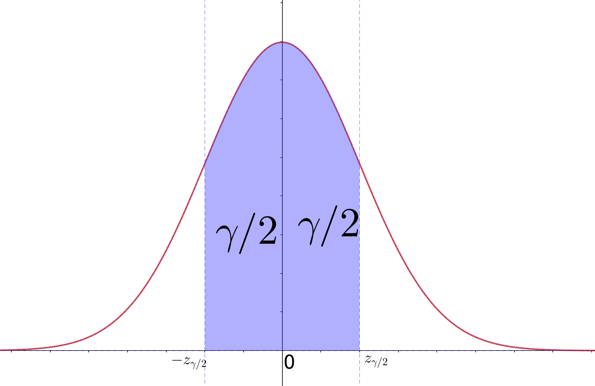

# Intervalo de confiança

## Intervalo de confiança para Normal

Vamos definir um nível de confiança $\gamma$. Sejam $-z_{\gamma/2}$ e $z_{\gamma/2}$ os valores que delimitam uma probabilidade $\gamma$ de forma simétrica na curva $\sim N(0,1)$

Temos que:

$P(-z_{\gamma/2} < Z < z_{\gamma/2}) = \gamma$

e

$-z_{\gamma/2} < Z < z_{\gamma/2}$

Podemos nos lembrar da parametrização para curva de médias amostrais:

$Z = \frac{\overline{X} - \mu}{\frac{\sigma}{\sqrt{n}}}$

Portanto:

$-z_{\gamma/2} < \frac{\overline{X} - \mu}{\frac{\sigma}{\sqrt{n}}}  < z_{\gamma/2}$

Se isolarmos o $\mu$ chegaremos a:

$\overline{X} - z_{\gamma/2} \frac{\sigma}{\sqrt{n}} < \mu < \overline{X} + z_{\gamma/2} \frac{\sigma}{\sqrt{n}}$ 

A inequação acima nos define uma faixa com $\gamma$ de probabilidade de conter $\mu$ . Podemos escrevê-la na forma de um intervalo:

$IC(\mu, \gamma) = [ \overline{X} - z_{\gamma/2} \frac{\sigma}{\sqrt{n}}; \overline{X} + z_{\gamma/2} \frac{\sigma}{\sqrt{n}} ]$

## Erro de estimativa 

Costuma-se usar como estimativa de erro o valor de metade do intervalo de confiança

$E = z_{\gamma/2}\frac{\sigma}{\sqrt{n}}$

## Intervalo de confiança para t

Podemos fazer uma derivação análoga para a distribuição $t$:

$IC(\mu, \gamma) = [ \overline{X} - t^{n-1}_{\gamma/2} \frac{s}{\sqrt{n}}; \overline{X} + t^{n-1}_{\gamma/2} \frac{s}{\sqrt{n}} ]$

## Exercícios 

